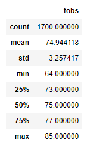
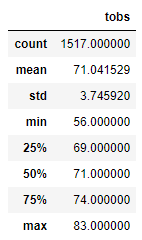
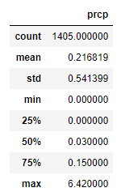

# Surfs Up Analysis

## Surfs Up Analysis Overview: 
The purpose of this analysis is to provide W. Avy more information to determine if the surf and ice cream shop business is sustainable year-round in Oahu.  Specifically, for this portion of the project, he would like to see temperature data trends for the months of June and December to help him make his final decision.

## Surfs Up Analysis Results: 
Provide a bulleted list with three major points from the two analysis deliverables. Use images as support where needed.eport that describes the key differences in weather between June and December and two recommendations for further analysis.

  - ### June Temperature Statistics

    
    
    

## Surfs Up Analysis Summary: 
Provide a high-level summary of the results and two additional queries that you would perform to gather more weather data for June and December.

W. Avy a summary of the precpitation for the Months of June and December to help him come up with what month is best for opening the surf and ice cream shop.

